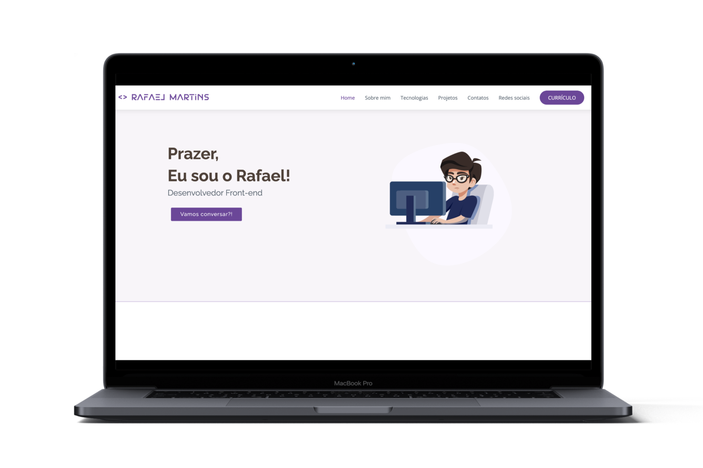

<h1 align="center">
    
    <br>
</h1>

<p align="center">
  <a href="https://www.linkedin.com/in/rafael-martins92/">
  
	</a>
  
  
  
  
  
  
  
  
</p>

<h4 align="center">
  <p>Rafael Martins - Portfolio</p>
  
  <p>This was my first project as a developer.</p>

  <p>I developed it with HTML, CSS, jQuery and Bootstrap.</p>

  <p>I also designed a layout with Figma.</p>

  <p>Here I can show my projects and show a little bit more about me.</p>
</h4>

<p align="center">
  <a href="#rocket-technologies">Technologies</a>&nbsp;&nbsp;&nbsp;|&nbsp;&nbsp;&nbsp;
  <a href="#information_source-how-to-use">How To Use</a>&nbsp;&nbsp;&nbsp;|&nbsp;&nbsp;&nbsp;
  <a href="#memo-license">License</a>
</p>

<p align="center">
  
</p>

## :rocket: Technologies

This project was developed with the following technologies:

- [HTML](https://developer.mozilla.org/pt-BR/docs/Web/HTML)
- [CSS](https://developer.mozilla.org/pt-BR/docs/Web/CSS)
- [jQuery](https://jquery.com/)
- [Bootstrap](https://getbootstrap.com/)
- [VS Code][vc] with [EditorConfig][vceditconfig] and [ESLint][vceslint]

## :eyes: Check it Out

You can try it here:

- [Rafael Martins - Portfolio][demo]

## :art: Layout

Check the layout here:

- [Figma][figma]

## :information_source: How to use

To clone and run this application, you'll need [Git](https://git-scm.com) installed on your computer. From your command line:

```bash
# Clone this repository
$ git clone https://github.com/rafaelmartins92/portfolio.git

# Go into the repository
$ cd portfolio

# Go to index.html
# Right click on it
# Run with Live Server
```

## :memo: License

This project is under the MIT license. See the [LICENSE](https://github.com/rafaelmartins92/portfolio/blob/master/LICENSE) for more information.

---

<h4 align="center">
    Made with ♥ by Rafael Martins 👋 <a href="https://www.linkedin.com/in/rafael-martins92/" target="_blank">Get in touch!</a>
</h4>

[vc]: https://code.visualstudio.com/
[vceditconfig]: https://marketplace.visualstudio.com/items?itemName=EditorConfig.EditorConfig
[vceslint]: https://marketplace.visualstudio.com/items?itemName=dbaeumer.vscode-eslint
[demo]: https://rafaelmartins92.github.io/portfolio/
[figma]: https://www.figma.com/file/Zhgpd7DPOJ5sNlVyl3Flyi/Rafael-Martins---Portfolio?node-id=0%3A1
